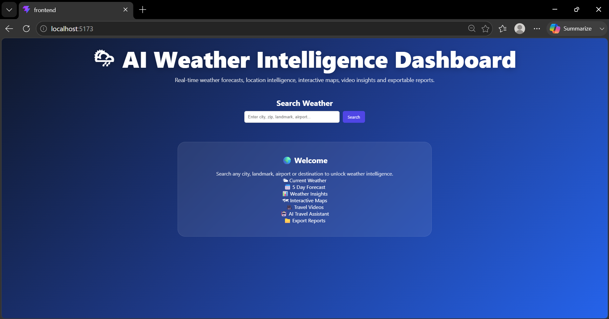
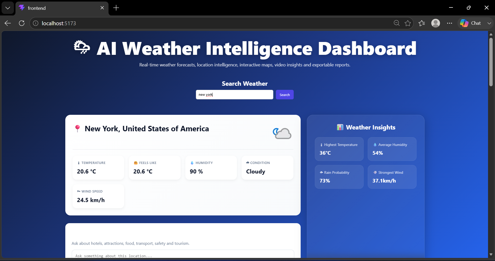
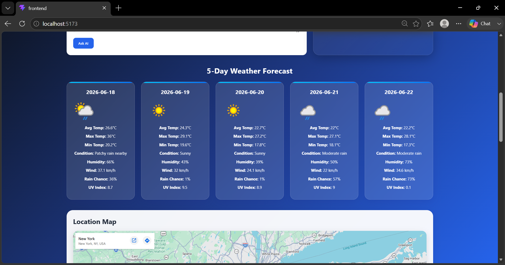
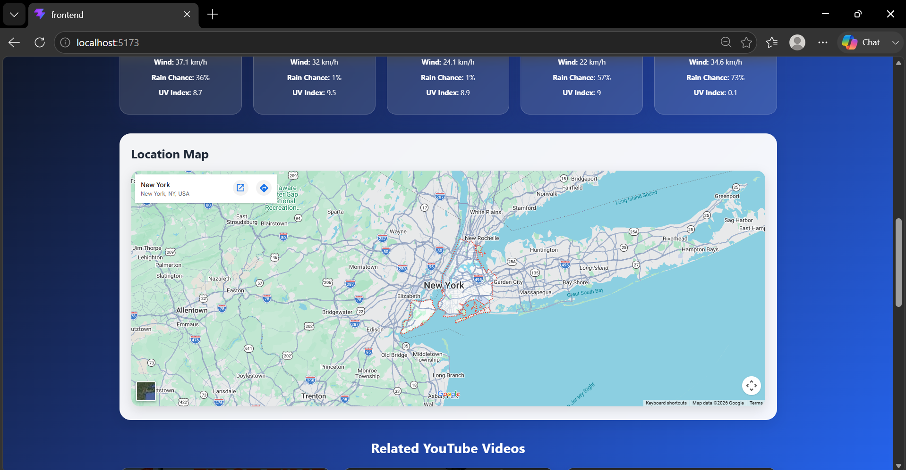
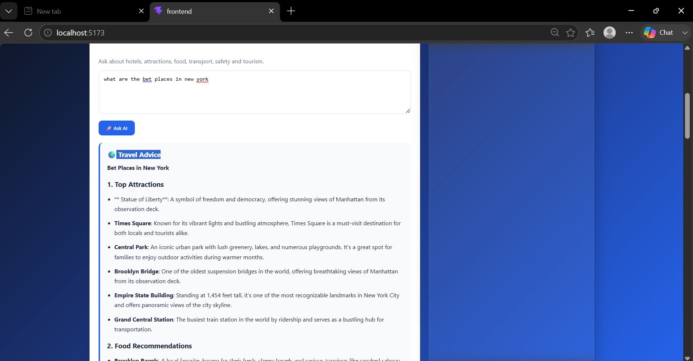
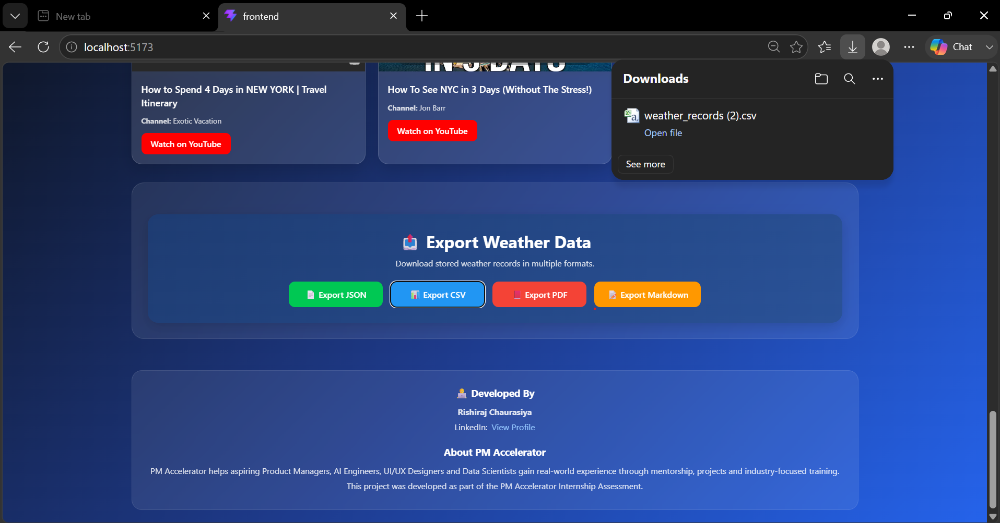
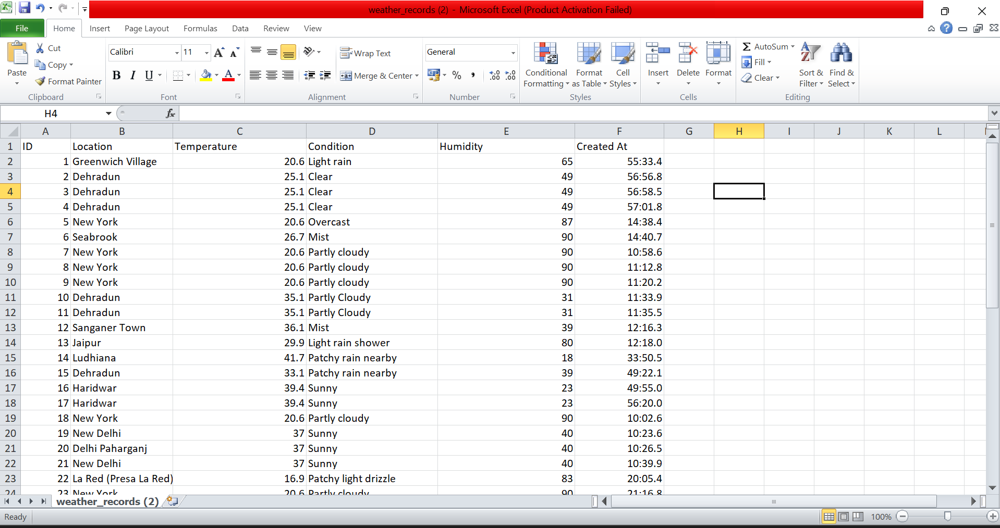

# 🌦 AI Powered Weather Intelligence System

## Overview

AI Powered Weather Intelligence System is a full-stack weather analytics platform built using React, FastAPI, SQLite, and Ollama.

The application provides real-time weather information, 5-day forecasts, location intelligence, travel insights, CRUD operations, export functionality, and an AI-powered Travel Assistant running locally through Ollama.

This project was developed as part of the PM Accelerator AI Engineer Technical Assessment.

---

# 🚀 Features

### Weather Intelligence

- Current Weather Data
- 5-Day Forecast
- Weather Insights Dashboard
- Location Search & Validation
- Current Location Detection

### Maps Integration

- Google Maps Integration
- Geographic Location Visualization
- Coordinate Resolution

### Travel Content

- YouTube Travel Videos
- Location-Based Travel Recommendations

### AI Travel Assistant

Powered by:

- Ollama
- qwen2.5-coder:3b

Capabilities:

- Hotels
- Attractions
- Restaurants
- Transportation
- Travel Planning
- Tourism Recommendations
- Safety Guidance

### Database Features

- Create Weather Records
- Read Weather Records
- Update Weather Records
- Delete Weather Records

### Export System

- JSON Export
- CSV Export
- PDF Export
- Markdown Export

### User Experience

- Responsive Design
- Error Handling
- Mobile Friendly Interface
- Interactive Dashboard

---

# 📋 Assessment Requirements Covered

✅ Current Weather Retrieval

✅ 5-Day Forecast

✅ Location Search & Validation

✅ Google Maps Integration

✅ YouTube API Integration

✅ SQLite Database

✅ CRUD Operations

✅ JSON Export

✅ CSV Export

✅ PDF Export

✅ Markdown Export

✅ AI Travel Assistant (Ollama)

✅ Responsive React Frontend

✅ FastAPI REST Backend

---

# 🛠 Tech Stack

## Frontend

- React
- Vite
- Axios
- CSS

## Backend

- FastAPI
- SQLAlchemy
- SQLite
- Pydantic

## AI

- Ollama
- qwen2.5-coder:3b

## APIs

- WeatherAPI
- Google Maps API
- YouTube API

---

# 🏗 System Architecture

Frontend (React)

↓

Backend API (FastAPI)

↓

SQLite Database

↓

External APIs

- WeatherAPI
- Google Maps
- YouTube

↓

AI Layer

- Ollama
- qwen2.5-coder:3b

---

# ⚙ Installation

## Clone Repository

```bash
git clone <your-repository-url>
cd ai-weather-system
```

## Backend

```bash
cd backend

pip install -r requirements.txt

uvicorn main:app --reload
```

Backend URL

```text
http://localhost:8000
```

## Frontend

```bash
cd frontend

npm install

npm run dev
```

Frontend URL

```text
http://localhost:5173
```

---

# 🤖 Ollama Setup

Install Ollama:

https://ollama.com

Start Ollama:

```bash
ollama serve
```

Pull Model:

```bash
ollama pull qwen2.5-coder:3b
```

Run Model:

```bash
ollama run qwen2.5-coder:3b
```

---

# 🔑 Environment Variables

Create a .env file

```env
WEATHER_API_KEY=your_weather_api_key

GOOGLE_MAPS_API_KEY=your_google_maps_key

YOUTUBE_API_KEY=your_youtube_api_key
```

---

# 📸 Screenshots

## Dashboard



## Weather Forecast





## Google Maps Integration



## YouTube Travel Videos


## AI Travel Assistant



## Export Functionality





---

# 🎥 Demo Video

Demo Video Link:

Add your Google Drive or YouTube link here.

---

# 👨‍💻 Author

**Rishiraj Chaurasiya**
AI Engineer Candidate

🔗 LinkedIn: https://www.linkedin.com/in/rishirajchaurasiya

## Assessment

PM Accelerator Technical Assessment – 2026

## About

This project was developed as part of the PM Accelerator technical assessment. The application combines real-time weather intelligence, AI-powered travel assistance, interactive maps, travel video recommendations, and exportable reports into a unified dashboard.
